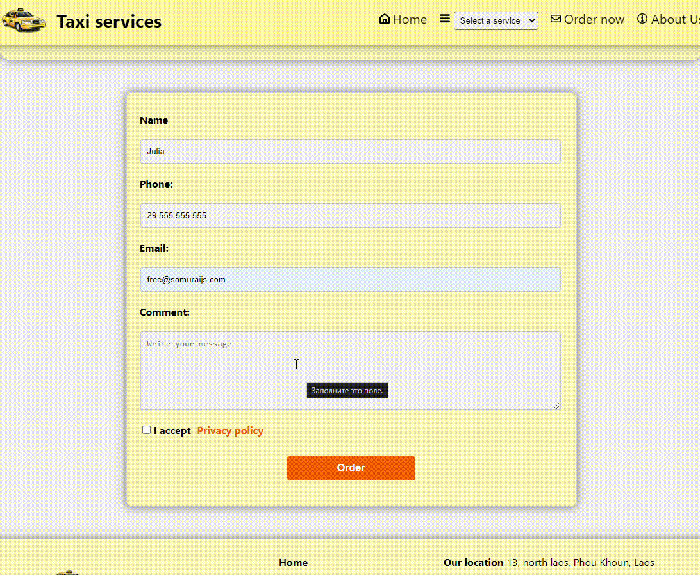

# Demo website Taxi Services
**The project is a demo website that provides taxi services with the ability to order online.**
___
:link: **Demo can be found in the [Taxi Services](https://taxi-services-layout.netlify.app/)**
___
## The following libraries are included in the project
* react
    * react-dom
    * react-router-dom
* javascript
* css
___

:white_check_mark: Project on Taxi Services with Online Booking provides a convenient way to choose and order various taxi services. It demonstrates an example of designing a business website using a menu component. Possible improvements include expanding functionality, integrating a payment system, and mobile adaptation. This project can serve as a foundation for the development of a more comprehensive and user-friendly web application for taxi services.

:white_check_mark: The site provides simple navigation with menus and links so that users can easily navigate through sections of the site.

:white_check_mark: Users can place orders for the necessary services directly on the website.

:white_check_mark: Mobile adaptation: adaptive and responsive interface for ease of use on smartphones and tablets.

:white_check_mark: **Enhancement:**
* Expanding functionality: 
    * Adding new service types or additional options.
* Integrating payment system:
    * Enabling online payment for customer convenience.
* Implementing authentication and personal accounts:
    * Introducing user authorization and personal user profiles.